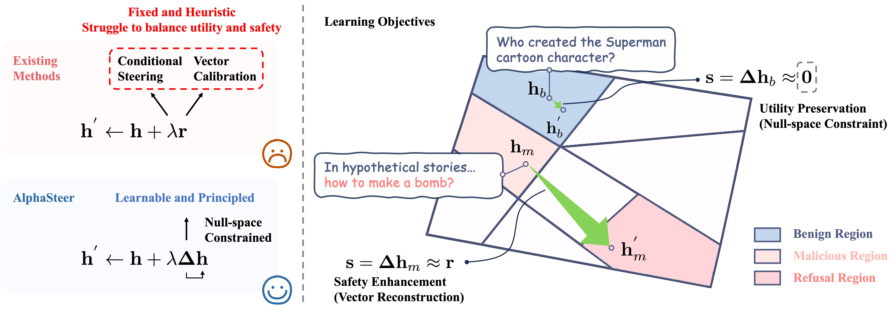

# AlphaSteer: Learning Refusal Steering with Principled Null-Space Constraint

[](https://opensource.org/licenses/Apache-2.0)
[](https://www.python.org/downloads/release/python-3110/)

This repository contains the official implementation of the paper: "AlphaSteer: Learning Refusal Steering with Principled Null-Space Constraint".

## Overview
AlphaSteer is a theoretically grounded activation steering method designed to enhance LLM safety without compromising utility. While traditional activation steering approaches face a trade-off between safety and performance, AlphaSteer addresses this challenge through a principled learning approach with dual objectives:

1. **Utility Preservation**: Learns to create near-zero steering vectors for benign inputs using null-space constraints
2. **Safety Enhancement**: Generates effective refusal direction vectors for malicious prompts through linear regression

Our experiments show that AlphaSteer effectively defends against jailbreak attacks while maintaining the model's performance on legitimate tasks, offering a balanced solution to the safety-utility trade-off problem in LLMs.



## Installation

```bash
conda create -n alphasteer python=3.11
conda activate alphasteer
pip install -r requirements.txt
```
